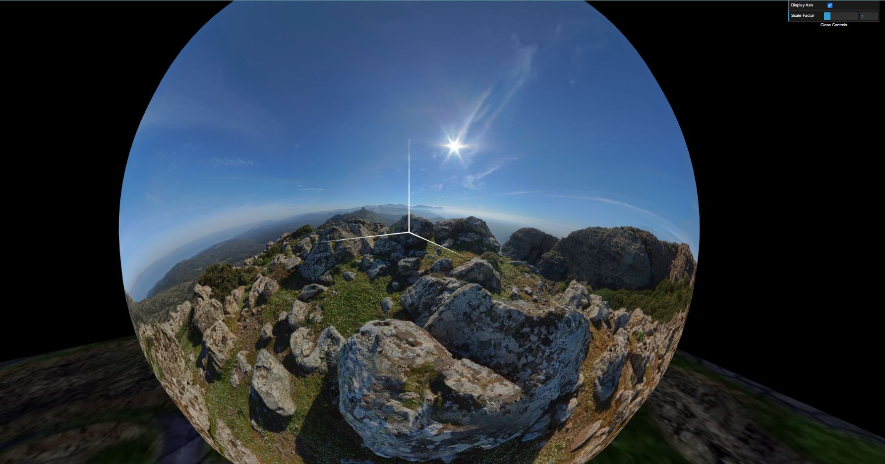
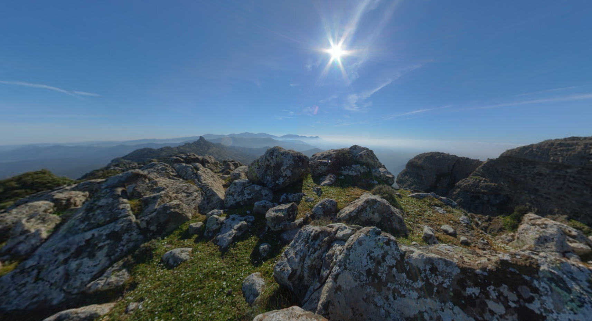
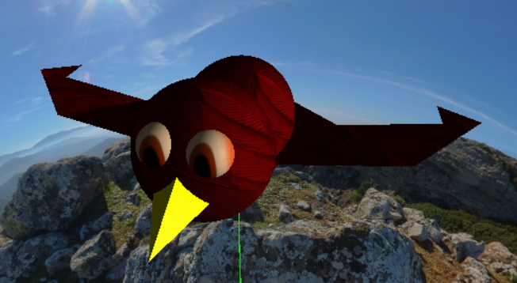
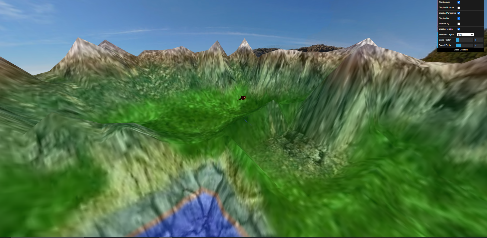
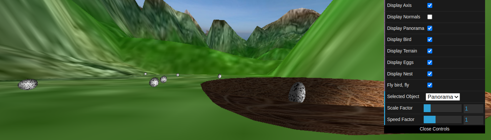
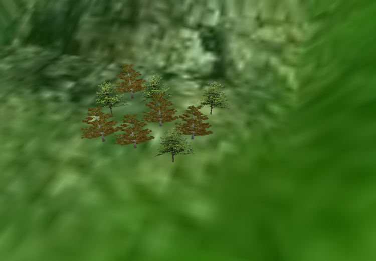
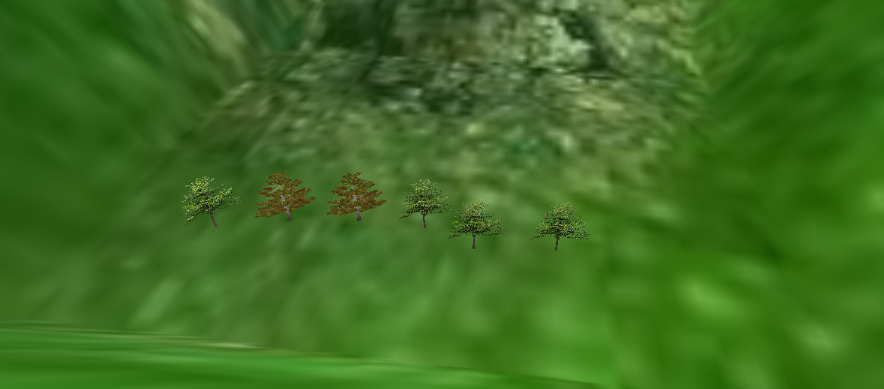

# CG 2022/2023

## Group T07G01
| Name             | Number    | E-Mail             |
| ---------------- | --------- | ------------------ |
| Pedro Veloso     | 201906293 | up201906293@up.pt  |
| Fábio Rocha      | 202005478 | up202005478@up.pt   

----

## Project Notes

### 2. Criação de Panoramas
#### Fora do Panorama

#### Fora do Panorama

### 3. Inclusão de uma Ave

### 4. Terreno

### 5. Ovos e Ninho

Devido à falta de tempo não conseguimos realizar a implementação do método de apanhar/largar ovos .

### 6. Integração de Árvores

#### 6.2. Arvoredo

 - Grupo de 9 árvores distribuídas em 3x3

-  Grupo de 6 árvores distribuídas em linha

### 7. Desenvolvimentos adicionais

Devido à falta de tempo não conseguimos realizar o ponto 7.

