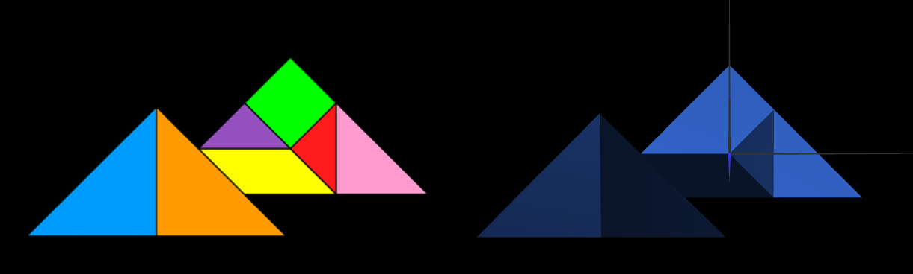

# CG 2022/2023

## Group T07G01

## TP 2 Notes

- All the exercises were pretty straight forward.
- In this tp we learned how to work with matrixes to perform geometric transformations, and how to use the instructions provided by the WebCGF library to facilitate making geometric transformations, as an alternative to the matrixes.

