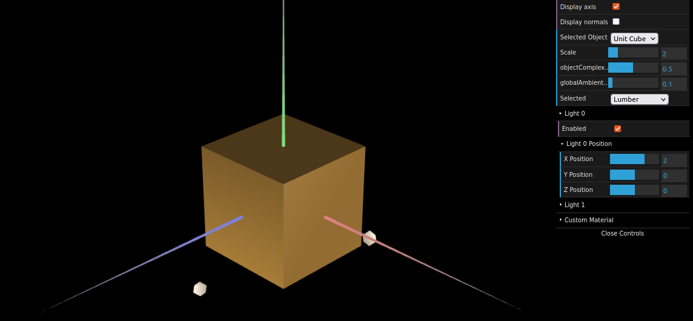
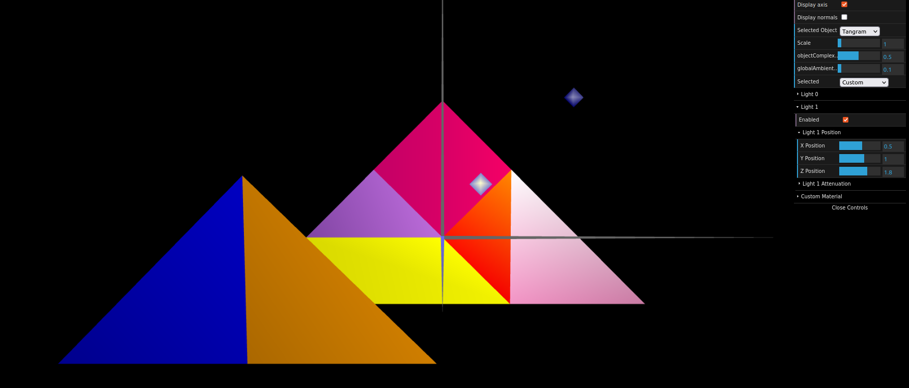
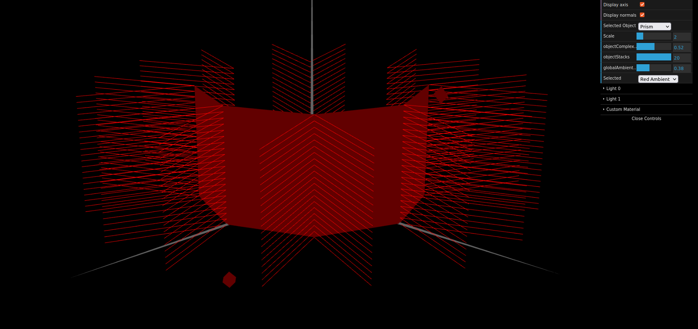
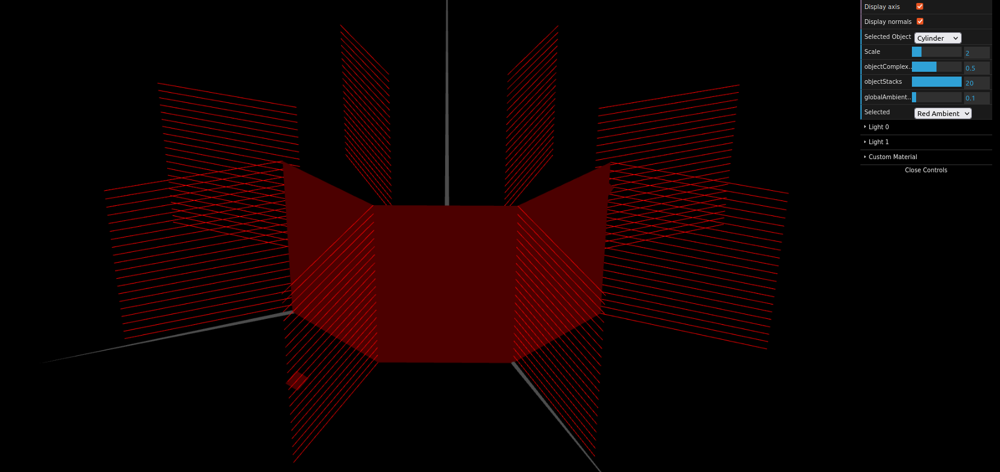

# CG 2022/2023

## Group T07G01

## TP 3 Notes

### Part 1

- The first two exercises were pretty straightforward, we had to get a better understanding of how normals work but after that it became easy.
- Creating a material with a similar color to wood was simple as we only had to follow the code already done for the other materials.

- Both fifth and sixth exercises were easy after understanding the principles in the previous exercises

### Part 2

- For this part we followed the pyramid example and only had to change the way the created the way we created the vertecis and calculted the normals. Nonetheless, this part wasn't hard.  

### Part 3

- In this part getting the normals right was easy after understanding them in the previous part. However, the indices were a bit confusing but we got there after a small while.
- Deleting duplicate vertices was also pretty straightforward.
- For the last exercise since we were already displaying the cylinder for testing the previous exercises there was no difficulty.

