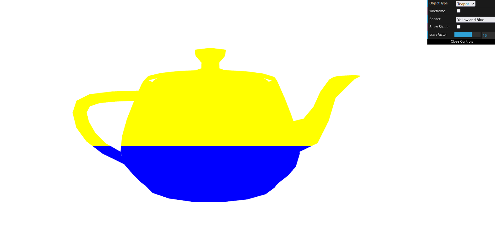
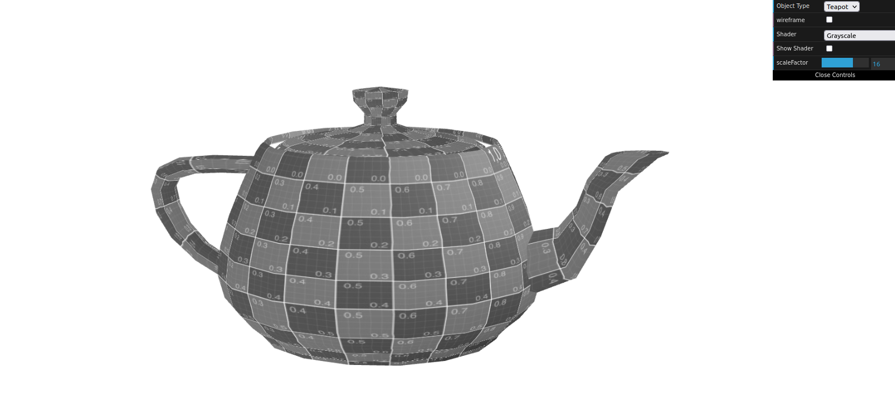

# CG 2022/2023

## Group T07G01

## TP 5 Notes

### Part 1

* The first and second exercises took some time to understand but after looking at the code provided to us we managed to get it.

* The last one was easy as we needed to look at another example to get this one right.

### Part 2

* We think we were able to do almost everything it was required but due to lack of time there were some things that we didn't get around to.

